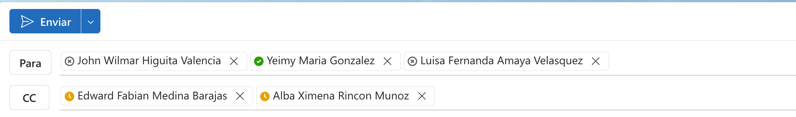

Genera al mismo nivel de este directorio un arhicov llamado Correo.md.

Debes hacer un correo dirigido a la coordinación titulada, el coordinador de tidulada john Higuita y las personas del area de biblioteca

el enfoque el correo es dar a conocer el formulario para que los aprendices puedan realizar el diligenciamiento del formulario adjuntando información como datos personales, fotografia y documento. decir que el enlace al formulario es https://carnetizacion.vermqen.com/.

tambien agregar en el correo que se agrega la pieza grafica para que sea divulgada por los medios que ustedes consideren adecuados para el logro de este objetivo.

Nota:
el correo tiene que ser super respetuoso y breve, sin salir del contexto.

