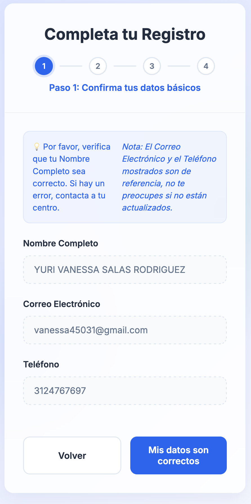
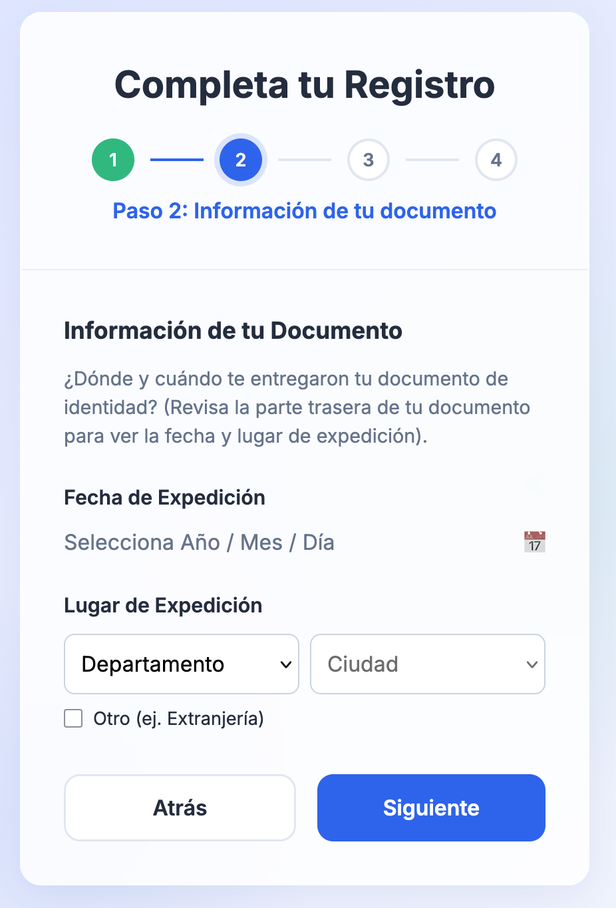
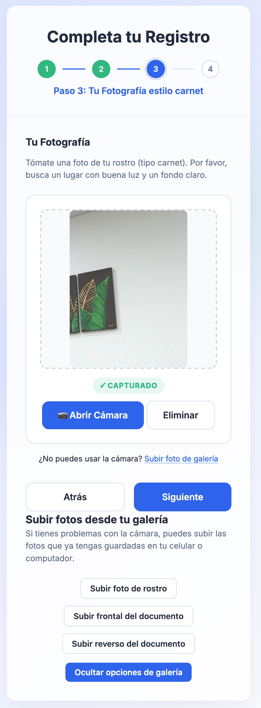
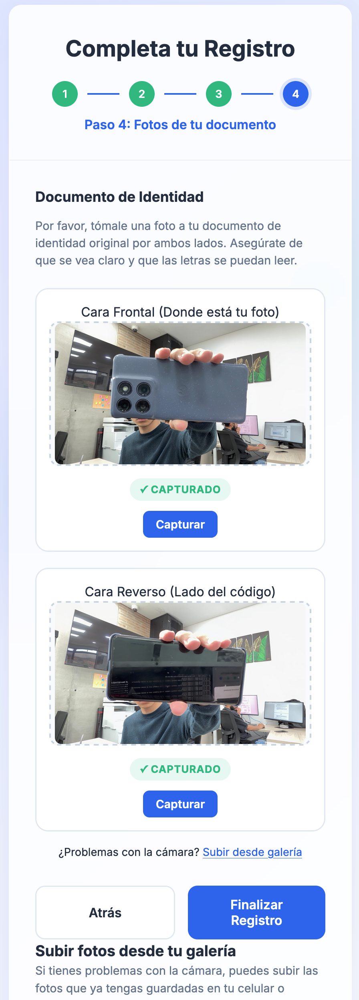
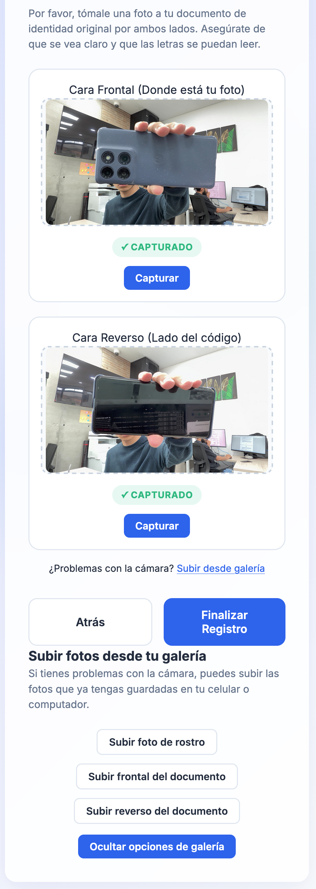

quiero que le hagas una validación de experiencia de usuario al proyecto:                                                             
   @/Users/melquiromero/Documents/SCA-CIDE/SCA-APP                                                            
                                                                                                              
   teneindo en cuenta los requerimientos:                                                                     
   @/Users/melquiromero/Documents/SCA-CIDE/requerimientos/problematica.md                                     
                                                                                                              
   el estado del proyecto es el siguiente:
   ya se tiene una versión estable del formulario y vista de admin, pero quiero que algunas cosas se hagan:
   1. en la partede la vista del paso 1 del formulario, se tiene un mensaje que dice "Nota: El Correo Electrónico y el Teléfono mostrados son de referencia, no te preocupes si no están actualizados." y esta bien pero se puede mejorar tambien indicando de alguna manera directamente en los campos ya que hay gente que no suele leer mucho, y si hubiera tambien una indicación adiconal en los campos correo electronico y telefono pues seria mejor. Ademas cambiar nombre del boton ya que dice "Mis datos son correcto" seria bueno que dijera algo como "Mi nombre es correcto" siendo que es lo que si o si debe coincidir(piensa en un mejor nombre).
   

   2. en la parte de la vista del paso 2 del formulario, se le pregunta al usuario "Fecha de Expedición" pero esto tiene un error ya que el modal para seleccionar la fecha, ya que el flujo del modal es el siguiente. 1.obliga al usario en seleccionar el año, 2. se cierra el modal y el usario tiene que volver a presionar el campo, 3. vuelve se abre el modal y aparece para seleccionar el mes, y 4. se cierra el modal y el usario tiene que volver a presionar el campo, 5. vuelve se abre el modal y aparece para seleccionar el dia. esto no es funcional, deberia dejar selecionar fecha presiza sin necesitad de que se cierre el modal de la fecha.
   

   3. en la parte del paso 3 del formulario, correspondiente al cargue de la fotografia del aprendiz, funsiona de forma decente si el aprendiz toma la foto directamente desde la pagina, pero para lación de "Subir foto de galería" se expande las opciones pero ademas de mostrar la opción de subir la foto desde la galeria, se muestran las opciones de subir la foto del documento de identificación(cc,ti,etc) lo cual esta mal ya que en este paso se debe enfocar solo en el cargue fotografico del aprendiz. entonces quita estas ultimas opciones dejando solo la de el registro fotografico del aprendiz. ademas de hacer la funcionalidad de tomar foto mas intuitiva.
   tipo la que uno puede llegar a encontrar en bancos como "banco bogota" donde literalmete tiene indicaciones graficas para el cargue correcto de la foto.
   Nota: algunos errores pequeños de esta parte del formulario son:
   1. al tomar la fotografia y presionar el boton capturar tiene unos estilos raros, corrigue para que sea mas atractivo.
   2. al tomar la fotografia de forma correcta y presionar el boton "Eliminar" no esta quitando la foto de la vista, obligando al usuario presionar el boton "Abrir Cámara" para volver hacer el cargue de la fotografia.

   

4. en la parte del paso 4 del formulario, correspondiente al cargue del documento de identificacion, aqui funciona decentemente pero se puede hacer mejor ya que tenemos los siguientes errores:
    1. Si se presiona la opción "Subir desde galería", pues primero aqui esta mal ya que deberia decir subir documento desde archivos ya que en el caso de que el aprendiz no tenga en ese moemento el documento fisico pues puede utilizar un archivo pdf donede este el documento de identificación por lado y lado, y este pdf seria el que se debe guardar en la ruta correspondiente, por lo que no se debe permitir subir desde archivos imagenes.
    el procesamiento si es una imagen se da si el aprendiz toma la foto del documento desde la misma pagina, en ese caso si pide la foto de lado y lado del documento, para luego generar un pdf y seria ese el que quede guardado en la ruta correspondiente, ya que la idea es almacenar un pdf del documento de identificacion por cada uno de los aprendices, ya que si guardaramos las imagenes quedarian dos por cada aprendiz, entonces esta parte es importante, si tienes dudas haslas saber para poder implementar.

    2. en esta vista no deberia aparecer el cargue de la fotografia del aprendiz, ya que eso se encarga en la vista anterior, asi que quita esa opción de esta vista.

    3. al tomar la fotografia del documento por lado y lado y luego vemos el pdf, tenemos un problema y es que no se esta enfocando al documento haciendo que en la fotografia que luego pasa al pdf, quede mucha información ambiental del entorno en que se tomo la fotografia, la idea ese que no solo se recorte la imagen sino que si obligue al usuario en ahcercar mas el documento para capturar los bordes del documento, y que este quede lo mas centrado posible en la captura, ademas de que en el caso de que la iluminacion sea poca o mala, se muestre una advertencia de que la iluminacion es poca o mala, para que el usuario pueda mejorar la iluminacion, de igual manera que se tenga un indicador de que se esta procesando el documento de identificacion. por eso insisto en tomar en ejemplo el banco de bogota, ya que el documento cuando lo cargan valida de que si se vea de forma adecuada el documento. para estaa funsionalidad puedes intallar algun componente que nos ayude, pero ojo recuarda qeu estamos en un hoting compartido por lo que no podemos usar tecgnologias como python ya que necesita terminal. y si usamos la terminal debe dejar todo empaquetado para no tener que intalar nada en el servidor.
    
    4. de igual manera a la toma fotografica, haz que sea mas intuitivo el cargue del documento de identificacion, de forma que el usuario pueda entender de forma clara como debe tomar la foto del documento de identificacion (lado y lado), y tenga un buen feedback visual de que se esta haciendo, de igual manera que en la fotografia se tenga un indicador de que se esta procesando el documento de identificacion.

    Nota: para el error 4, quiero que si es necesario modifiques la forma en tomar la fotografia del documento de identificación, para que sea mas intuitivo.

   quiero que al finalizar hayas estrucutado de forma adecuada las vistas y no solo en lo frontend sino       
   tambien backend                               

   si es necesario crea una estructura de directorios.                                                        
   esoto para poder orgainzar la documentación
   
   