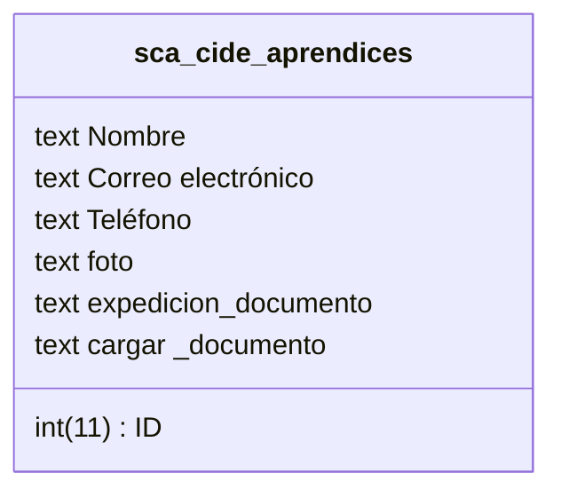
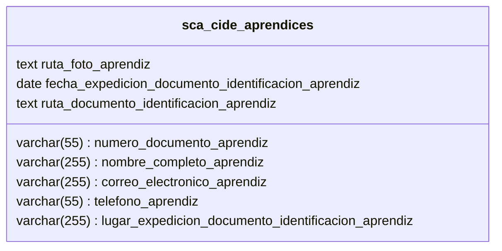

# para esto se debe tener en cuenta lo siguiente:

## esquema tabla:

extructura tabla por si no puedes ver la imagen:

como puedes ver la tabla tiene unos errores, en esos esta en que falta el campo "lugar de expedición del documento de identificación del aprendiz", el campo "foto" no deberia llamarce asi ya que deberia aparecer "ruta_foto" esto para hacer referencia a lo que va a almacenar, en este caso va a guardar la ruta del archivo en la carpeta "SCA-APP/fotografias/ejemplo_para_hacer_referencia_al_archivo:{1073672380.png}", la idea es que guarde la ruta, de igal manera para el campo "carga_documento" que lo vamos a renombrar por "ruta_documento_identificacion" y los datos que va a guradar tambien va hacer la ruta del archivo pdf en la carpeta "SCA-APP/documentos_identificacion/ejemplo_para_hacer_referencia_al_archivo:{1073672380}.pdf", la idea es que guarde la ruta del archivo. para que luego la persona que va a generar los carnet, pueda descargar los documentos fotograficos he pdfs.
para el campo de "expedicion_documento" lo vamos a renombrar por "fecha_expedicion_documento_identificacion" y el tipo de dato va hacer "date" para guardar solo fecha, ya que actualmente se esta guardando como texto.

## tabla correjida

## vista 1(modulo 1):

una vista la cual pregunte el numero de documento del aprendiz si el documento se encuentra en la tabla sca-cide_aprendices, el sistema debe dejar llenar el formulario y autocompletando los campos c1omo nombre, correo, telefono, en caso de que no se encuentre en la tabla, el sistema debe mostrar un mensaje de error y no dejar llenar el formulario, el error no debe ser "el numero de documento ingresado no corresponde a un aprendiz registrado". y no lo dejara pasar hasta que el numero de documento si sea de un aprendiz registrado.

## vista 2(modulo 1):

el sistema una vez validado que el numero de documento si corresponde al de un aprendiz, se debe autocompletar y regisrar los datos:
    text ruta_foto_aprendiz
    date fecha_expedicion_documento_identificacion_aprendiz
    varchar(255) lugar_expedicion_documento_identificacion_aprendiz
    text ruta_documento_identificacion_aprendiz

para esto se debe generar el formulario de forma muy intuitiva, parametrizar que la fotografia este en un formato tipo imagen tipo .png o jpg, y el documento en .pdf se debe mover los archivos a sus carpetas respectivas y guardar la ruta en los campos correspondientes de la tabla.

### reglas para el formulario:
1. si el aprendiz vuelve a llenar el formulario se tiene que borrar los datos anteriores al igual que los documento fotografico y pdf, ya que los datos se van a actualizar.
2. la fotografia dada por el usuario se le debe hacer una recorte para que quede en un formato tipo carnet, ademas de optimizarla para que no sea tan pesada, para esto se debe utilizar tecnologias que ayuden a este procesamiento sin perder tanta calidad, la idea es que la fotografia quede pesando entre 200kb a 500kb.
3. el documento que se suba en formato .pdf se debe optimizar para que no sea tan pesado, para esto se debe utilizar tecnologias que ayuden a este procesamiento sin perder tanta calidad, la idea es que el documento quede pesando entre 300kb a 1000kb.

nota para ti gemini: Relacionado a el pdf para el documento ya que creo que seria mejor que el aprendiz le tome foto por lado y lado al documento, luego el sistema haga un pdf libiano con las dos fotos y se guarde ese pdf en la ruta dicha y en la tabla se guarda la ruta, en reemplazo del pdf que se sube.
para esto se le debe indicar de forma intuitiva al aprendiz como debe tomar las fotos del documento de identificación, como ejemplo lo hacen algunos bancos como banco de bogota.

----

para desarrollar esto puedes usar cualquier tecnologias y lenguajes pero tienendo en cuenta que tenemos un hosting compartido y no tenemos un VSP por lo que no podemos ejecutar codigo python o algo que nos genere utilizar terminal, si podemos usar cosas de terminal que se puedan hacer de forma local y luego podamos subir esos archivos como ejemplo la carpeta vendor.

-----

para estilos igual puedes usar tecnologias distintas y nuevas si queirs pero que sea compatible con el hosing compartico.
Nota: estamos usando hotinger compartido.

## vista 1 (modulo 2):

en el mismo formulario del modulo 1 si se ingresa una contraseña especifica se accedera a una interfaz nueva la cula tiene como propocito gestionar los registros de los usuarios, aqui ya puedes hacer uso de la creatividad para que la persona pueda ver los aprendices que registraron el formulario y poder descargar la fotografia y documento ademas de ver la información registrada por el usuario.

salida final:
debes generar una app completa con todo lo solicitado en:
SCA-APP

ten presente el .env:
SCA-APP/.env
ya que cuenta con la conexión a la base de datos.
